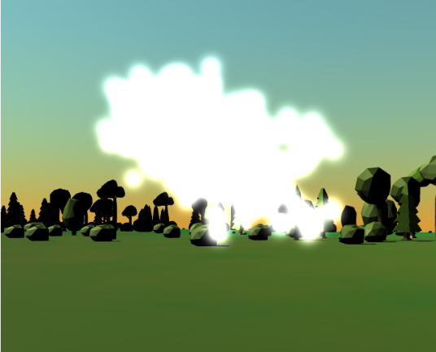
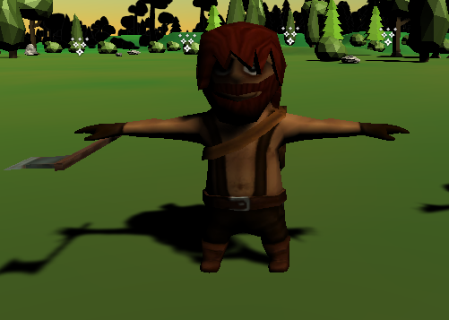
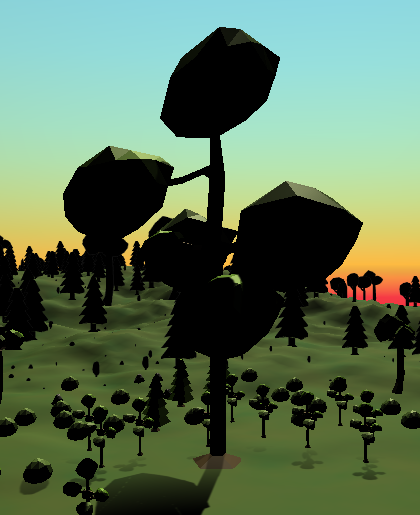
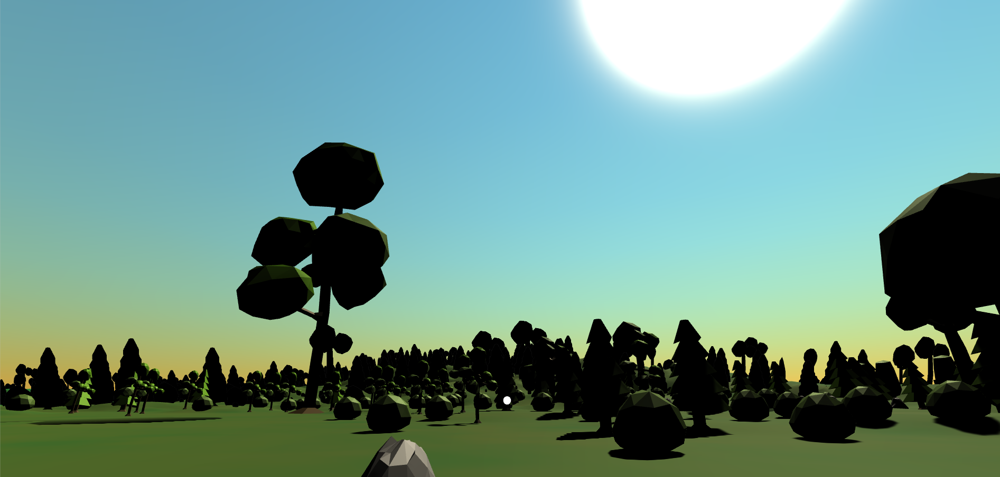

# Árbol Madre

Árbol Madre es un juego inmersivo de realidad virtual en el que el jugador debe escoltar a la diosa del bosque, Artemisa, protegiéndola de los malvados leñadores que quieren talar el bosque, hasta llegar al Árbol Madre, donde Artemisa podrá lanzar un hechizo que acabará con la maldad de los leñadores y salvará el bosque.

## Repositorio

Estructura general del repositorio:
- **/src**: contiene el proyecto Unity (para Windows 10).
- **/img**: imágenes de este documento.
- **Presentación Árbol Madre**: presentación de la aplicación en pdf.
- **arbolmadre.apk**: aplicación lista para instalar en dispositivo Android.

## Uso

La interacción se realiza únicamente con el movimiento de la cabeza:
- **Movimiento**: Fijar la mirada en una flor mágica transportará al jugador hasta ella.
- **Combate**: Fijar la mirada 2 veces en un leñador lo matará.

El objetivo del juego es llegar a la última flor, bajo el Árbol Madre, momento en que se gana la partida.

Si, por el contrario, mueren el jugador o Artemisa antes de llegar al Árbol Madre, se pierde la partida.

## Elementos visuales principales

**Artemisa**:  

**Leñadores**:  

**Flores mágicas**:  

**Árbol madre**:  

**Spawn**:  

## Hitos del proyecto

- Interacción con la mirada (Realidad Virtual): para moverse y atacar.
- Eventos y delegados: en combate, si se recibe un golpe, se reduce la vida. Esta interacción requiere el uso de eventos y un GameController. También los mensajes de Victoria y Derrota, entre otros.
- Sistemas de partículas: Artemisa es un sistema de partículas creado con las herramientas de Unity.

## Tareas

La distribución de tareas entre los autores se ha realizado de la siguiente manera:

- **David de León Rodríguez**:
  - Desarrollo conceptual del proyecto
  - Diseño inicial de clases
  - Desarrollo de las clases base
  - Implementación de los NPCs

- **Alejandro León Fernández**:
  - Desarrollo conceptual del proyecto
  - Diseño inicial de clases
  - Desarrollo de las clases base
  - Implementación de los NPCs
  - Implementación del GameController
  - Implementación de combate
  - Implementación de movimiento
  - Implementación de eventos de victoria y derrota

- **Sara Revilla Báez**:
  - Desarrollo conceptual del proyecto
  - Diseño inicial de clases
  - Búsqueda de assets y arte
  - Diseño de la escena: terreno, SkyBox, GameObjects
  - Modificaciones para Realidad Virtual
  - Implementación de combate
  - Implementación de movimiento
  - Implementación de evento de victoria

